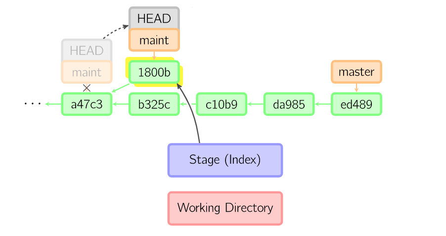
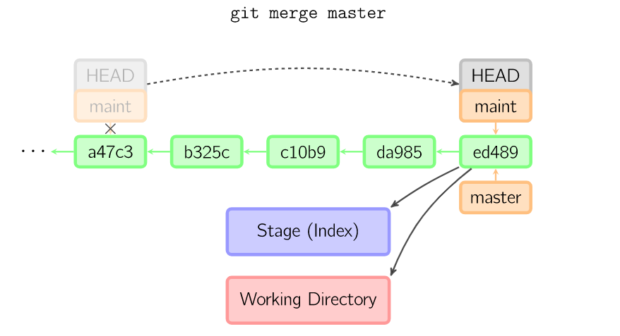
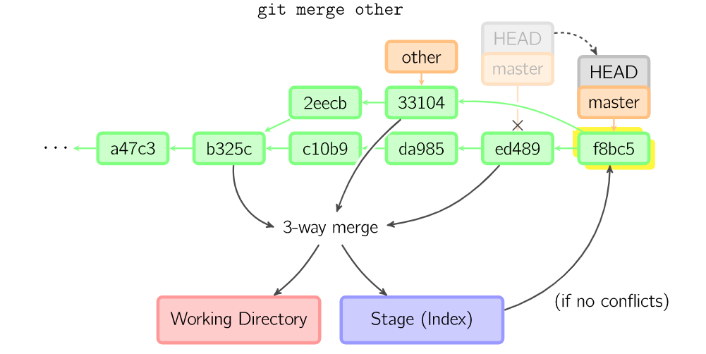

=====
Lab 2
=====

Welcome to the second SSXG Git Course lab! This lab will teach you where Git shines: in collaborating with others! After learning a simple sequence of steps and commands in Git, you will never need to worry that your little changes may break everyone else's work.... but even if they do, you'll know how to handle it! 

--------
Overview
--------

By the end of lab 2, you will:

- Have a good understanding of *branches* and *merges* in a typical Git workflow
- Understand why Git is referred to as a "**Distributed** Version Control System" (**DVCS**)
- Learn how to collaborate in a **centralized workflow**
- Master the  fundamental git commands *branch* and *merge*
- Work with remotes using *remote*, *clone*, *fetch*, *merge*, *push*, and *pull*

--------------
Homework Recap 
--------------

In the pre-lab homework you learned the basic cmoands for working with branches and remotes in Git. Some commands you should recognize are:

- git branch
- git merge
- git remote
- git clone
- git fetch
- git push

Any questions on the pre-lab homework before we begin?

---------------------------
The Tree of Lif- er - Git
---------------------------

In this lab you will hear about **branches** a lot, and start to see the tree-structure underlying the Git repository. From last lab, we know that all repositories come with a built-in **branch** called **master**. I'll emphasize again that the name **master** is not important (and can be overridden if you like). Also, the **master branch** is not fundamentally different from any other Git branch. It is simply a convenient, well, *master* branch to work from. I think of it like the *trunk* of the Git tree. When you start a project, it will be on the trunk and everything else will branch out from there.

Branching is a simple, lightweight way to crate an alternate line of commits in Git. Recall that a commit is a simple record of changes that points to the previous commit. A new branch exists as a 40 character file in your .git/ folder which has a name (other than **master**) and points to a previous commit. Additional commits on a branch will point to previous commits on that branch, leaving commit history of other branches completely unaffected. The best way to understand this is with a visualization. 

When comitting to a repository with only one **master** branch, here you can see that the staged changes are added as a new commit and the **master** branch now points to the new latest commit, "f0cec". Recall that HEAD points to the current branch. Since there is only one branch, HEAD always points to **master** and moves along with it in the commit:

.. image:: commit_one_branch.png

Now, say we branched **master** earlier with a maintenance branch called "**maint**". To commit to **maint**, we would switch to the **maint** branch, stage, and commit our changes there. Here you can see that the new commit, "1800b" begins a separate history from **master**. HEAD still points to **maint**, and **maint** now points to our new commit in uncharted waters, "1800b":

There are several good reasons to branch a Git repository. Here are a few:

1) Testing new developments separately from **master**.
2) Gives you peace of mind that you aren't breaking anything on **master**.
3) Ensures that **master** is always working and useable.
4) You can switch to your working **master** branch at any time to do work, even if nothing is currently working on your testing branch.
5) Branches with new developments can simply be merged into **master** later once they are fully tested.

------------------------
Mergers and Acquisitions
------------------------

(Okay, just mergers...)

Working from our **maint** branch example, say we got everything working and want those maintenance changes to be reflected in **master**. Here is where Git shines. We simply need to tell Git to **merge** the two branches, and then Git *usually* does all of the grunt work for you. Let's go over what is actually happening and when we might need to help Git with a **merge**

^^^^^^^^^^^^^^^^^^
Fast-forward merge
^^^^^^^^^^^^^^^^^^

This is a trivial case of merging that will likely occur in your private repositories. It happens when you have worked entirely on one branch and want to merge it back into another unchanged branch. Here, the most recent commit in **maint** is part of the same history as **master**, so all that needs to happen is for **maint** to *fast-forward* to the most recent commit in **master**:

^^^^^^^^^^^^^^^
Three-way Merge
^^^^^^^^^^^^^^^

This is the case where the **other** branch and **master** branch have both changed since the two parted ways. This is a common scenario when working with collaborators (e.g. maybe a new feature was added to **master** while you were working on **other**). Most of the time the changes do not affect each other. Maybe each branch has a small change in different files or even different folders. Here, Git can automatically merge the branches in what is called a **three-way merge**. The three "ways" refer to the following three commits:

1) the most recent **other** commit ("33104"), 
2) the most recent **master** commit ("ed489"), and 
3) the first common ancestor between **other** and **master** ("b325c"):

Here, Git processes all of the changes that occurred since "b325c" on both branches. Finding that none of the changes are in conflict with each other, Git imports all of the changes since "b325c" from **both branches** into the working directory and stages it for you. You then simply need to commit your merge. This is a good opportunity to ensure that everything is correct before permanently changing **master**, and also a good place to leave a nice commit message detailing the implications of the merge.

Notice that before initiating a merge you always want to be on the branch that you are merging changes *into*. After the merge, HEAD remains on that branch. When the **other** branch is successfully merged into **master**, all changes from it are now reflected in **master** and the **other** branch can be safely deleted.

^^^^^^^^^^^^^^^^^^^^^^^^^^^^
The (Dreaded) Merge Conflict
^^^^^^^^^^^^^^^^^^^^^^^^^^^^

Occasionally when trying to merge branches, there will be changes that have been made to the same parts of the same file. This results in a **merge conflict**. Since Git doesn't understand code, it cannot decide which version to keep when lines have changed in both branches. This is good! Git simply flags the lines that are in conflict and allows you to choose which to keep in the merged version. Since you probably won't run into merge conflicts when working on your own individual repositories, but it is an integral part of collaborating with others, we will dedicate the first part of next week's lab to *Resolving the Merge Conflict*.

P.S. Don't dread this! This is Git looking out for you and making sure you don't overwrite you collaborator's hard work (or at the very least make you skim your collaborator's hard work before overwriting it with your own, superior work).

------------------------
The Centralized Workflow
------------------------

Last time we said that Git is a Version Control System (**VCS**), but to be more specific, it is a **Distributed** Version Control System, or **DVCS**. A **DVCS** is a **VCS** that is fully distributed to each system that it exists on. With other version control systems, you might only checkout snapshots of the most recent files, but with a **DVCS** you mirror the *entire repository*. This means that no one repository location is special in Git. This also means that if one server hosting the repository fails, any other existing repository can fully restore it. Pretty neat (more reading on **VCS** types `here <https://git-scm.com/book/en/v2/Getting-Started-About-Version-Control>`_).

What does this mean for maintaining a workflow with collaborators through Git? Basically, it means that you have options. In this lab I will show you **one** way of working with others in Git, but it is by no means the **only** way. I believe the **centralized workflow** will be the simplest for our numbers and purposes (and it avoids learning about `benevolent dictators and lieutenants etc etc <https://git-scm.com/book/en/v2/Distributed-Git-Distributed-Workflows>`_).

The **centralized workflow** is summed up in this image:

.. image:: centralized_workflow.png

In it, each *developer* has a **clone** of a **remote** *shared repository* as a *local repository* on their system. To make changes, each *developer* follows this sequence of steps to minimize merge conflicts:

1) Before starting work, **fetch** and **merge** the most up-to-date version of the *shared repository* into the *local repository*. 
2) Work on changes locally and, when ready, **commit** those changes locally.
3) Before sharing the local changes, **fetch** changes from the *shared repository* once again in case it has been changed by another *developer*. If necessary, **merge** those fetched changes locally.
4) Finally **push** the local changes to the *shared repository* for all other collaborators to **fetch** and enjoy.

There's a lot going on and we'll go into each step the practice, and again in the summative next week. But if we're fetching and pushing to a remote, we first need ask: "*where's the remote*?"

-------------------
Where's the Remote?
-------------------

There are several options available for hosting Git projects "in the cloud", and each has different strengths (here is a whole `list of websites <https://www.git-tower.com/blog/git-hosting-services-compared/>`_ with descriptions). You could also set up a repository on a private internal server as your *shared repository* (remember, in a **DVCS** no one repository is special), but hosting your repository online gives you a few advantages:

1) You have access to your repository, anytime, anywhere, on any device (any device with Git, maybe not your smart toaster)

2) Many websites have useful GUIs (Graphical User Interfaces) for browsing your repository, your commit history, checking collaborators, or managing *Pull Requests* (more on that later)

3) Already having your code, commit history, and documentation online ensures that **when you're ready**, you can release your code to the wider scientific community or to the public to do more transparent, productive, and reproducible science

I'll stop beating around the bush, I know you all want to hear about `GitHub <https://github.com/>`_. GitHub is a ridiculously large Git repository hosting service that was started about 10 years ago and now hosts over `63 millions projects from over 23 million people <https://github.com/about>`_. Needless to say it is the largest open source code hosting service ever and has somehow continued to be a free. I'm not endorsing it as the best place to host your code, but it is the most recognized service and I find it very intuitive to use.

Github also offers students a *huge* package of free services from diferent publishers, many of which will only be of interest to you if you wish to pursue software development. One useful service is the one offered by GitHub itself, giving you access to unlimited private repositories while you are a "student at a degree-granting institution". There is a full list of free services and a link to get the pack at `Student Developer Pack <https://education.github.com/pack>`_. 

(Again, all images were borrowed from `A Visual Git Reference  <http://marklodato.github.io/visual-git-guide/index-en.html>`_ by marklodato on GitHub, and a lot of this lab was based on the excellent `PeepCode Git Internals <https://github.com/pluralsight/git-internals-pdf>`_ guide.)

--------
Practice
--------
Here we will practice branching, merging and working with remotes. Recall the commands we know so far and feel free to refer back to them here:

From lab 1:

- **git init** creates a new Git repository.
- **git status** inspects the contents of the working directory and staging area.
- **git add** adds files from the working directory to the staging area.
- **git diff** shows the difference between the working directory and the staging area.
- **git commit** permanently stores file changes from the staging area in the repository.
- **git log** shows a list of all previous commits.
- **git checkout HEAD** discards changes in the working directory.
- **git reset HEAD** unstages file changes in the staging area.
- **git reset <SHA-1>** resets to a previous commit in your commit history.

From lab 2 pre-lab homework:

- **git branch** lists all branches.
- **git branch <branch_name>** creates a new branch.
- **git checkout <branch_name>** switches to the specified branch.
- **git merge <branch_name>** join file changes from the specified branch with the current branch.
- **git branch -d <branch_name>** deletes the specified branch
- **git clone <repo>** creates a local copy of a remote repository.
- **git remote -v** lists this repository's remotes.
- **git fetch** downloads work from the remote into the origin/master branch.
- **git merge origin/master** merges origin/master into the current branch.
- **git push origin <branch_name>** pushes specified branch to the origin remote.

Other useful commands we will use:

- **git branch --set-upstream <branch_name> <remote_branch>** makes an existing branch track a remote branch.
- **git pull** fetches and merges changes from remote into the current branch.
- **git commit --amend** allows you to edit the most recent commit message.
- **git merge --abort** is used to undo a merge (often one that caused conflicts).
- **git rm <file>** removes and deletes a file from the project.
- **git rm <file> --cached** removes the file from Git tracking, but keeps local copy of file.

For a single searchable list with all your git command needs, bookmark this `cheatsheet <http://cheat.errtheblog.com/s/git>`_.

^^^^^^^^^^^^^^^^^^^^^^^^^^^^^
Lab 2 Part A - Review / Setup
^^^^^^^^^^^^^^^^^^^^^^^^^^^^^

Let's start a new repository for a quick refresher from lab1. Open a terminal window and cd into your Desktop. Make a directory called 'lab2':

	**mkdir** lab2

Initialize it:

	**git** init

Let's first make a file on the default **master** branch. Call it "script1.py" and put the comment "# This is script 1" on the first line. You can do this in explorer/finder or with the following command:

	**echo** "# This is script 1" > script1.py

Now let's add our first file:

	**git** add script1

And make our first commit:

	**git** commit -m "Add script1"

^^^^^^^^^^^^^^^^^^^^^^^^^^^^^^^^^^^^
Lab 2 Part B - Branching and Merging
^^^^^^^^^^^^^^^^^^^^^^^^^^^^^^^^^^^^

Now let's branch our repository. Call the new branch **new_feature**:

	**git** branch new_feature

Let's see what our old friend *status* has to say:

	**git** status

We're still on branch **master**. Recall from lab1 that *checkout* allowed us to view old commits. It also allows us to change the current branch (i.e., it points HEAD to the branch we specify):

	**git** checkout new_feature

Even though it gave us confirmation, let's check our status again:

	**git** status

Now that we are on **new_feature**, let's implement a new feature in file "script2.py":

	**echo** "# Wow, this is a new feature!" > script2.py

Let's add this new file:

	**git** add script2.py

And commit it to the **new_feature** branch:

	**git** commit -m "Add a new feature in script2.py"

Okay, that was a lame feature. Let's open up script2.py and write a function:

|def feature():
|	"""Excellent docstring"""
|	return("I'm the feature from script2!"")

Let's quick commit this time:

	**git** commit -a -m "Add feature function to script2.py"

Now that we have a branch with a couple of commits, let's head back over to **master** to merge the changes:

	**git** checkout master

For the sake of demonstration, let's try to delete our **new_feature** branch "by accident" before we merge it:

	**git** branch -d new_feature

Git has your back and reminds you that **new_feature** is not yet merged. Let's merge it now. Add the "-v" flag for a full breakdown of what we're merging:

	**git** merge new_feature -v

Git notifies us this is a *Fast-Forward* merge. Since we did not change **master** before merging in **new_feature**, it fast-forwards **master** to the latest **new_feature** commit. As always:

	**git** status

Let's see our branch situation:

	**git branch**

Adding the "-v" flag tells us what commit each branch is on. Let's make sure they agree as we'd expect:

	**git** branch -v

Now since **new_feature** has been sucessfully merged into **master**, it is safe to delete:

	**git** branch -d new_feature

This is a good opportunity to talk about the "detached head" warning that we encountered when we tried to checkout an old commit in lab1. Remember HEAD *always* points to the most recent commit in each branch. So when you checkout an old commit, your HEAD (still pointing to the most recent commit) becomes detached. Let's try it. First find an old commit:

	**git** log --abbrev-commit

And checkout the "Add scipt1" commit using its SHA code:

	**git** checkout <SHA>

Here, you should have received your *detached HEAD* warning. Now if you were to make changes and commit them, you would be essentially "rewriting history". Git, as always, as your back and suggest instead to make a branch. So let's do that:

	**git** branch another_feature

And switching to that branch:

	**git** checkout another_feature

Now, in this branch off of an old commit, we are no longer in *detached HEAD* state. It is now safe to make and commit changes. Say we want to add yet another feature, this time in "script3.py":

	 **echo** "# Another day another feature" > script3.py

Now we can have some fun with **git log**. You already know the **--oneline** flag to simplify output. Let's add a few more flags (**--all** to show all branches, **--decorate** to add branch names, **--graph** to show an ASCII representation of the repository. The order of the flags does not matter:

	**git** log --all --decorate --graph --oneline

Woohoo! Now we can see the HEAD location, the **master** branch, the **another_feature** branch, the latest commits for each, and at which commit they diverged. And all this in only a few lines. This is a very simple example, but you can imagine ow useful it would be to visualize a project with a long commit history and several branches in this way. 

Now comes the moment you've all been waiting for. A three-way merge. Recall three-way merges involve the most latest commit on two branches and the commit at which they diverged. Let's "*HEAD*" back over to the **master** branch (har har):

	**git** checkout master

And let's merge **another_feature** into **master**

	**git** merge another_feature

And it's as simple as that. Let's see how that merge shows up in the commit history:

	**git** log

Notice that our *Fast-forward* merge simply entered commits as if they were always on **master**, but the recent *three-way* merge has its own commit message "Merge branch 'another_feature'". If ever you want to see the commit history without merge commit message, do:

	**git** log --no-merges

Don't forget to delete the another_feature branch when you are finished with it!

	**git** branch -d another_feature

And it's always good to double-check:

	**git** branch

^^^^^^^^^^^^^^^^^^^^^^^^^^^^^^^^^^^
Lab 2 Part C - Working with Remotes
^^^^^^^^^^^^^^^^^^^^^^^^^^^^^^^^^^^

Let's set up a GitHub repository to track your lab2 local repository. First head over to GitHub and log in. Add the top, select the "+" drop-down menu and "create new repository". There will be a few options. By convention, usernames and repositories on GitHub are usually all lowercase. Name your new repo "lab2" and give it a description. You can make it private and ignore the options about a README, .gitignore, and LICENSE for now.

Because GitHub is very user-friendly, it already tells you what to do before I get a chance. Under "**...or push an existing repository from the command line**" you will see:

	**git** remote add origin https://github/<your_username>/lab2.git
	**git** push --set-upstream origin master

Do this from the command line (make sure you're in the lab2 git repository. You can type **pwd** to get your present working directory). If you used a different email to set up GitHub than the one you specified in you .gitconfig, you may need to update that with:

	**git** config --global user.email "<you@somewhere.com>"

So what did we just do? A couple things. First, we added a new **remote** to lab2 called **origin**. Like the name **master**, we could ave called this anything, but by convention the remote that points to your centralized **master** branch is generally called **origin**. 

Then, we made our first **push** to remote repository. In doing so, we "set the upstream" by telling Git we always want this local repository to **push** and **fetch** from the remote we called **origin**. We also told Git which branch we were pushing to **origin** by specifying **master**.

Whew.

Now click over to your /<username>/lab2 page on GitHub. On the code tab you should see our script1, scipt2 and script3 files. Congratulatiions, you pushed a *local* repository to a *remote repository*! 

Now, say there is an existing GitHub repository we want to have locally on a different computer or want to **clone** a collaborator's repository to start working on it. First we would go to that repository's page on GitHub and hit the green "clone or download" button on the right to copy the full web url path. THen we would navigate to the folder where we want the repository to reside. Let's **cd** to the Documents folder (or somewhere that isn't the Desktop).

	**cd** /Users/<you>/Documents

Let's **clone** our repository into the Documents folder, recalling the http path we copied earlier:

	**git** clone https://github.com/<username>/lab2.git

Now you've cloned a remote repository! Let's **cd** into it:

	**cd** lab2

And we can look at our beautiful scripts straight outta GitHub:

	**ls**

Now you know how to start a remote repository on GitHub, clone that repository as a local repository, and begin working on your code. Now, before you start working on a *local repository*, recall the tenets of the **centralized workflow**:

1) Before starting work, **fetch** and **merge** the most up-to-date version of the *shared repository* into the *local repository* 

		**git** fetch origin -v

	Changes, if any, are stored in the local "origin/master" branch. If necessary:

		**git** merge origin/master

2) Work on changes locally and, when ready, **commit** those changes locally. 

	*I will add to this: first make a development branch off of master to start making changes, and merge it back into master when you are ready to push*

		**git** branch development

	Work on new branch awhile and then switch back to **master** and:

		**git** merge development

3) Before sharing the local changes, **fetch** changes from the *shared repository* once again in case it has been changed by another *developer*. If necessary, **merge** those fetched changes locally.

	Same protocol as Number 1.

4) Finally **push** the local changes to the *shared repository* for all other collaborators to **fetch** and enjoy.

		**git** push origin master

Congratulations for making it through Lab 2!

-----
Recap
-----

In this lab you learned:

- How Git's repositories are distributed rather than localized
- How to work in a *centralized workflow*
- How to get a bunch of free stuff from GitHub
- How to branch a repository
- How to merge a branch into the master branch of a repository
- The difference between a fast-forward and three-way merge
- How to start a repository on GitHub and point to it with a remote
- How to push to a remote
- How to clone a repository from GitHub

Next week, we will culminate the lab course by talking about merge conflicts, and working on a final project in parallel using the centralized workflow!