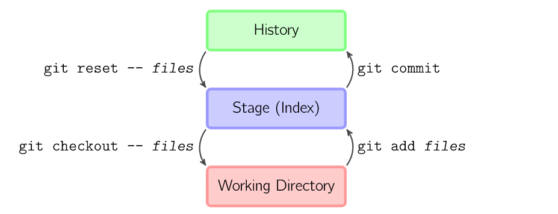
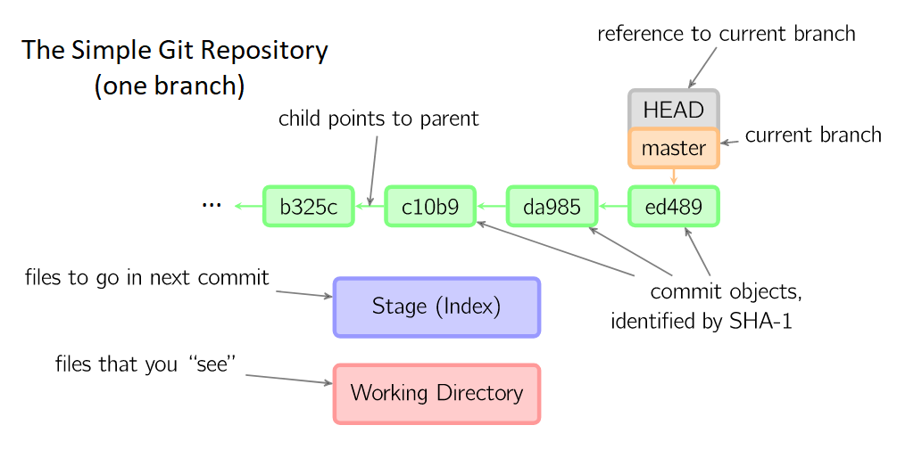

=====
Lab 1
=====

Welcome to the first SSXG Git Course lab! This lab will teach you a new research superpower: **version control**! **Version control** with Git is one of the easiest ways to share research code with collaborators, keep track of your research at each step of the development process, and is a good start towards doing quality, reproducible research. When you can refer back to each step in your research process, you never have to wonder how you got that pesky thing to work all those months ago...

--------
Overview
--------

By the end of lab 1, you will:

- Have a working understanding of how and why Git works
- Learn the ins and outs of a typical Git repository
- Master the  fundamental git commands *init*, *add*, and *commit*
- Investigate the local directory, staging area and commits using *status*, *diff*, and *log*

--------------
Homework Recap 
--------------

In the pre-lab homework you learned the fundamentals of Git. Some commands you should recognize are:

- git init
- git status
- git add
- git diff
- git commit
- git log

Any questions on the pre-lab homework before we begin?

-----
WTG!?
-----

Git is an example of a Source Code Management (**SCM**) tool or Version Control System (**VCS**). A **SCM**/**VCS**, is a *system* that helps developers *manage*/*control* *versions* of their *source code*. Each **VCS** keeps track of different versions of code and usually offers tools for sharing and developing code in parallel with collaborators. This process is all covered under the blanket term **version control**.

Has one of these happened to you?::

|	"I deleted my code and now it's all gone and I'm sad"
|	"I changed something in my code and now everything is broken. I wish I could go back to when it was working..."
|	"I saved like 20 different versions of my code but I don't know which ones work and how to find the vesion I want"
|	"Jane made a great feature in the code she copy and pasted from me, but I've changed a lot of my code since then and it will take forever to figure out how to combine the two"

Each version control system offers solutions to these common problems in software development. Although it is not the only **VCS** (others include Subversion (**SVN**), Mercurial, etc.), Git has become the most used **VCS** by far in recent years. This is partly because it is very simple to use and is very efficiency in what it does when compared to other version control systems. Let's explore the clever idea behind Git before we get to the lab work.

---------
Snapshots
---------

The basis of all that happens in Git are the "commit" objects, which I like to think of as snapshots of your code. In actuality, Git has a much more elegant way of keeping track of your code that doesn't involved copying the whole directory each time you commit. Let's look under the hood.

Here we see the three main "areas" where your files can be located in a Git repository. At the bottom, we have the *Working Directory*. This is simply the folder that you are working in, as you see it. A Git *Working Directory* will have a *.git* folder to let Git know that you want this folder to be tracked.

In the middle is the *Stage*, *Index*, or *Staging Area*. This is where you prepare your files to commit to Git history. You can add or remove files from the staging area until it's just right before taking a snapshot with a commit.

At the top is the *History*. This is a record of all commits which have ever occurred in this Git repository. Behind the scenes, Git keeps track of just enough information on each commit to fully recreate your *working directory* the way that it was at the time of your commit.

A simple Git history can be seen below:

Each commit object has a unique SHA-1 code that can be used to refer back to it if necessary, and they form a linear chain from one commit to the next. Every Git repository has an original *master* branch, and for the purposes of this lab, it will be the only branch (more on branching in lab 2). The *HEAD* reference tells Git which branch you are on, and the branch points to the most recent commit in the history of your *working directory*

The genius idea behind Git is pretty simple:

	DON'T copy every file and folder in your directory at each commit when most of the time only a few files (or a few lines of a few files) actually change from commit to commit. 

Instead, Git keeps track of your original directory as it was when you initialized it, and each commit only tracks the *changes* to each file on a case-by-case basis. This way, if you write two lines in a file and commit it, Git only has to keep track of those two lines, where they are located, and assign a SHA-1 code to the commit. When you want to revert to a certain commit, Git simply has to take the original directory and total all of the changes to it from each commit in the chain up to the commit you chose. This is an *extremely* efficient process. 

For a fun fact/demonstation of Git's efficiency::

	The Ruby on Rails Git repository download, which includes the full 
	history of the project – every version of every file, weighs in at
	around 13 MB, which is not even twice the size of a single checkout 
	of the project (~9 MB). The Subversion server repository for the 
	same project is about 115 MB. 

(Images borrowed from `A Visual Git Reference  <http://marklodato.github.io/visual-git-guide/index-en.html>`_ by marklodato on GitHub. The fun fact was taken from `PeepCode Git Internals <https://github.com/pluralsight/git-internals-pdf>`_ by Scott Chacon, the guide that inspired most of this lab. Refer to it for more info on anything Git!)

--------
Practice
--------
Here we will practice initializing and using our own Git repository. Recall the commands we know so far and feel free to refer back to them here:

- **git init** creates a new Git repository.
- **git status** inspects the contents of the working directory and staging area.
- **git add** adds files from the working directory to the staging area.
- **git diff** shows the difference between the working directory and the staging area.
- **git commit** permanently stores file changes from the staging area in the repository.
- **git log** shows a list of all previous commits.
- **git checkout HEAD** discards changes in the working directory.
- **git reset HEAD** unstages file changes in the staging area.
- **git reset SHA** Resets to a previous commit in your commit history.

^^^^^^
Config
^^^^^^

When using Git for the first time on a computer, it is useful to tell it your name and email. This is how Git will track who is making commits to a repository:

	**git** config --global user.name "Your Full Name"

And:

	**git** config --global user.email "you@somewhere.com"

This information will be stored in the *~/.gitconfig* file in your home directory.

^^^^^^^^^^^^^^^^^^^^^^^^^^^^^^^^^
Lab 1 - The basic Git Repository
^^^^^^^^^^^^^^^^^^^^^^^^^^^^^^^^^

Open a shell window. Navigate to your Documents folder using the **cd** (change directory) command. You can type out the full path or navigate one folder at a time. The **ls** (list contents) will list the files and directorires in your current directory and is often helpful for navigating the shell. 

Create a new folder called *lab1* in your Documents using *mkdir* ("make directory"):

	**mkdir** lab1

Enter your new directory using **cd**. Let's tell Git to track our directory:

	**git** init

You should see a confirmation message "Initialized empty Git repository". You can check that the *.git* folder was created using:

	**ls** -all

Now we can start coding. In your favourite text editor, create the file *script1.py* with the following Python function::

|def HelloWorld():
|    """
|    """
|    print("Hello World")

Make sure to save the file to your lab1 directory. Now lets head back to the shell and see what Git thinks of our new file:

	**git** status

In the summary, we can see that *script1.py* is untracked. Let's add it to the *staging area* with:

	**git** add script1.py

Now that it is staged, let's make our first commit to the git repository. Don't forget to always leave a useful commit message with the -m flag. Messages should be present tense with enough info to remember what changed in this commit:

	**git** commit -m "Add my message to this commit"

Now return to your text editor and make two new files, *data1.txt* and *data2.txt*. You can write whatever you like in the files. Now let's check the status of the repository again:

	**git** status 

Let's say we do not want git to keep track of our data files until we find some real data. It's fine to leave them untracked in the lab1 directory, but the *Untracked files* notifications may get tiresome. To tell git to exclude specific files, we can create a *.gitignore* file in the repository. This can be done from the shell with::

|	"> .gitignore"

Or in command line with::

|	"cd. >.gitignore"

Now open up the *.gitignore* file and either add the two data files by name on separate lines, or use the wildcard character (\*) to exclude all text files with the single line::

|	"\*.txt"

Now add and commit your *.gitignore* to your git repository. Check that the text files are gone by checking the status of the repository yet again (you will probably do this often):

	**git** status

Now return to *script1.py* and define a second function *GoodbyeWorld* that prints "Goodbye World" so that the file looks like::

|def HelloWorld():
|    """
|    """
|    print('Hello World')
|
|def GoodbyeWorld():
|    """
|    """
|    print('Goodbye World')

Save the file, then add your changes to the staging area. Before you commit, you remember you wanted to document your functions. Return to *script1.py* and fill in your empty docstrings. Remember that docstrings, like commit messages, should also be present tense and imperative. Now *script1.py* could look something like this::

|def HelloWorld():
|    """
|    Print Hello World  
|    """
|    print('Hello World')
|
|def GoodbyeWorld():
|    """
|    Print Goodbye World
|    """
|    print('Goodbye World')	

If we check git status now, we see that script1.py is still staged from before, but now it also has unstaged changes. Let's say you want to check the difference between **your current directory and the last commit**, you can use the command:

	**git** diff

If you ever get stuck in a *diff* or *log* command in the shell, type "q".

But this doesn't show the changes you have already staged. To see the difference between your **staged changes and the last commit**, you can use the --cached flag:

	**git** diff --cached

This is a good place to pause and make sure you understand what happens when you stage files, and what differences the "**git** diff" and "**git** diff --cached" are showing you. If you need to, you can discard all the changes to *script1.py* and return to just after we comitted the *.gitignore* using:

	**git** reset HEAD

THis discards the changes in the staging areas. Then to revert *script1.py* to the way it was at the last commit:

	**git** checkout script1.py" 

Then you can work through the changes to *script1.py* again starting with adding the GoodbyeWorld function, just to ensure that you know which changes went into the staging area. If you feel comfortable with the staged and unstaged changes to *script1.py*, we can move on to how we will commit them.

Here, we have a couple options. For one, we could unstage everything in the staging area using "**git** reset HEAD" and then stage and commit *script1.py* with the up to date changes. A shorter way of accomplishing this is simply running **git add script1.py** to stage the most recent changes to script1.py. This would result in the same commit as in option 1. 

A third option is to store our changes as two separate commits. The trick to making the most out of Git is to have deliberate commits and useful commit messages. At the end of the day (or month, or year), your commits will be your only snapshots of your project. Let's first commit the changes we already had staged:

	**git** commit -m "Add GoodbyeWorld function"

You can check with "**git** diff" that only the documentation changes need to be committed now (WARNING: Here's is a quick but dangerous shortcut that will simultaneously **add** AND **commit** all modified or untracked files in the directory, skipping the staging area. Use with caution and always know what you're committing!):

	**git** commit -a -m "Add documentation to HelloWorld and GoodbyeWorld"

Now we can look at the log and see the commit history of lab1:

	**git** log

Here is where your commit messages shine! You can see the unique commit ID, the author name and email you set at the beginning, the date and time, and the useful commit message for each commit we made. The log command has some useful flags to make the output more pretty... The --pretty flag for instance:

	**git** log --pretty=oneline

We can filter log output too. Try:

	**git** log -n 3

Or:

	**git** log --since="1 month ago" --until="10 minutes ago"

If you're still lost with your detailed commit messages and want to find where a certain insertion of deletion happened, you can use the -p flag to see the full *diff* between each commit:

	**git** log -p

Congratulations for making it through Lab 1!

-----
Recap
-----

In this lab you learned:

- How Git stores and keeps track of your files over time
- How to track a directory with Git using git init
- How to track new files or stage modified files with git add
- How to commit changes and write useful messages with git commit
- How to check the status of your repository with git status
- How to track differences in your repository or staging area with git diff
- How to get a detailed (or pretty) history of the repository's commits with git log

Next week, we will get to the meat of why Git is perfect for team projects when we talk about branching, merging, and remote repositories!