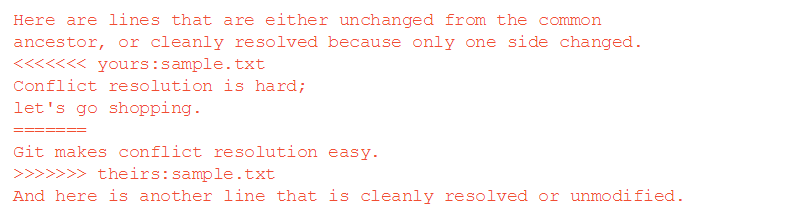
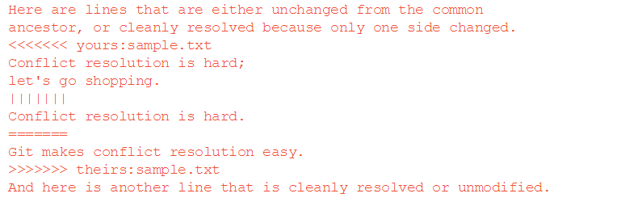

=====
Lab 3
=====

Welcome to the final SSXG Course Lab!

This lab will teach you how to collaborate on Git code with others in a realistic workflow example. You will master the art of collaborating on a GitHub-hosted repository through the **centralized workflow**. You will also learn to resolve **merge conflicts** and **pull requests**.

--------
Overview
--------

By the end of lab 3, you will:

- Have a good understanding of **merge conflicts** and **pull requests**
- Have practical experience using all of the Git tools we've learned so far in a real-world example
- Master the **centralized workflow**
- Be ready to host and contribute to collaborative repositories on GitHub!

--------------
Homework Recap
--------------

There was no pre-lab homework this week!

Any questions on Git, GitHub or anything we've discussed or practiced in the course so far before we begin?

----------------------------
The Merge Conflict Revisited
----------------------------

Recall from lab 2 that a **merge conflict** can arise if the same line in two branches has been changed. This can also happen if a file was changed in one branch and deleted from another. In either case, since Git does not assume which changes are correct, we need to tell it which change to commit.

Resolving a **merge conflict** generally happens in 4 steps:

1) Identify the files that are in conflict (Git conveniently does this step for us).

2) Choose the version of each conflicted file to keep. Git adds text to the conflicted files to indicate which lines need to be resolved. You can then open the files, see the conflicts, and decide which to keep (in the practice section, we will look at a tool that helps with this step).

3) Once the conflicts are resolved, stage the desired files with **git** add <resolved-files>.

4) Finally, continue with the merge using **git** merge --continue. This will proceed with the merge and - barring missed conflicts - commit the merge to the Git history.

If you are in **merge conflict** mode and want to abort the merge, returning to before you attempted it, you can use:

	**git** merge --abort

Let's check out how Git presents us with **merge conflicts**:

This may be intimidating to look at to start, but when you know which markers to look out for it becomes much easier. The lines with "**<<<<<**", "**>>>>>>**", or "**======**" will tell you which version of the line you are looking at.

Here, the text between the "**<<<<<<< yours:**" and "**=======**" is always the version of the line in the current branch

The text between "**=======**" and ""**>>>>>>> theirs:**" is from the branch you are trying to merge in. 

In the practice, we will enhance this output to the "diff3" style. This adds a third section in between "yours" and "theirs" which shows the *common ancestor* of the two branches. This can help jog your memory as to why the line was changed in each branch and which is the change you actually want to keep. Diff3 makes the output look like:

Here everything is the same, except a new section between "**| | | | | | |**" and "**=======**" is added for the common ancestor text. For a more full description of this example, head over to the documentation for `Git Merge <https://git-scm.com/docs/git-merge>`_ and scroll down to `How Conflicts Are Presented <https://git-scm.com/docs/git-merge#_how_conflicts_are_presented>`_.

In the practice, you will be shown one possible tool for resolving merge conflicts in the command line with vim. That being said, a variety of mergetools exist, and some have GUIs if you prefer that to the command line. I recommend spending a small amount of time investigating a **mergetool** that you are comfortable with and that helps you visualize the conflicting changes. Here is a short list of `Diff and Merge Tools <https://www.git-tower.com/learn/git/ebook/en/command-line/tools-services/diff-merge-tools>`_ that you can install for your operating system. We will go in depth into the vim command line mergetool in the practice.

-------------
Pull Requests
-------------

When it comes time to merge your changes into the master branch of a shared GitHub repository, it can be helpful to notify your collaborators about your changes before you make them. To do this, we use a **pull request**. A **pull reuest** is a *request* that you make to your collabortors to *pull* your changes into the master branch. This gives others the opportunity to see your commits, make comments, or even make commits of their own to ensure that your changes are merged smoothly.

**Pull requests** are handled through GitHub. In the practice, we will see that starting one is as easy as selecting the branch with your changes, selecting the target branch, and adding some comments for your collaborators. Once the **pull request** is created, all collaborators *with commit access* to the target branch will automatically be notified of your request. Onec everyone is satisfied, the request can be merged into the master branch from GitHub.

---------------------------------
Practice Part A - Merge Conflicts
---------------------------------

First up is the **merge conflict**. In this section, I will give you instructions but omit the code snippets that I have given you so far. Everything you need to know is in the previous two labs or can be found with a quick online Git documentation search. If you can do it without any help, that's great, but don't worry if you need to refer back. All programmers need to look up syntax sometimes and one could argue that knowing how to do this effectively is more useful than memorizing any one language....

Before we start, let's set the default mergetool to *vimdiff*:

	**git** config --global merge.tool vimdiff

Set the default conflict style to *diff3*:

	**git** config --global merge.conflictstyle diff3

And eliminate the pesky confirmation message that shows up when we run **git mergetool**:

	**git** config --global mergetool.prompt false

Now, here is an example that I "borrowed" (ahem.. stole..) from the internet. I suggest you try to do the following without looking at the link (by all means look at your old labs or google for Git syntax). But in case you get stuck, here is the full walkthrough, `Use vimdiff as git mergetool <http://www.rosipov.com/blog/use-vimdiff-as-git-mergetool/>`_.

1) Make a directory called "zoo".

2) Initialize *zoo* as a Git repository.

3) Create a text file called "animals.txt".

4) Type four words into *animals.txt* on four separate lines: "cat", "dog", "octopus", "octocat".

5) Stage, then commit *animals.txt* to Git history.

6) Make a new branch called *octodog*.

7) Switch to the *octodog* branch.

8) Change the word "octopus" in *animals.txt* to "octodog".

9) Stage and commit *animals.txt*.

10) Return to the master branch.

11) Change the word "octopus" in *animals.txt* to "octocat".

12) Stage and commit *animals.txt*.

13) Now merge the *octodog* branch into *master*.

14) Here is where you should get a merge conflict message. If not, make sure you didn't miss a commit or forget to save a file along the way. You can revert the merge or start again from the top if you need to.

Now for the fun part, resolving the merge conflict we created!

First let's visualize it with our mergetool:

	**git** mergetool

Don't be intimidated by the output! Let's go through it from left to right, top to bottom:

The top left pane is the **LOCAL** pane. This is the version of *animals.txt* as it exists in the current branch (in this case, **master**). Remember that we changed "octopus" to "octocat" on the **master** branch**.

The top middle pane is the **BASE** pane. This is the common ancestor. In it, we see "octopus" which we wrote in the initial commit.

The top right pane is the **REMOTE** pane. This is the branch that is being merged in. Remember we were merging in the **octodog** branch where we changed "octopus" to "octodog".

Finally, the bottom pane is the **MERGED** pane. This is what will be saved in the repository when we are finished resolving the conflict. Recall from the background info that Git demarcates the conflict with text flags, but these will be removed when we choose our final version to commit.

Now it is time to tell Git how to resolve our conflict. Since we only have one, this will be a simple example, but the following procedure can be applied to any number of conflicts:

1) Move the cursor down to the conflicted area in the **MERGED** pane (remember if you need any help navigating vim, check out the cheatsheet in the */cheatsheets* folder).

2) Choose a version of the conflict to keep. Your options are **LOCAL**, **BASE**, and **REMOTE**. The commands for these are **:diffget LO**, **:diffget BA**, and **:diffget RE**, respectively.

3) Repeat 1 and 2 until all conflicts are resolved.

4) Save and quit vim, writing to multiple files with **:wqa**.

5) Commit your merge with a simple **git commit**. Here is a scenario where you may want to write a more detailed message about the merge and how you resolved the conflicts.

So to finish our example, head down to the **MERGED** pane, keep the "octodog" change using **:diffget RE**, save and quit with **:wqa**, then commit. Now you can check that *animals.txt* has the "octodog" change, that your git log shows the merge commit, and do some garbage collection by deleting the **octodog** branch.

Congratulations on resolving your first **merge conflict**!

------------------------------------------------------
Practice Part B - Pull Requests & GitHub Collaborating
------------------------------------------------------

The aim of this section of the practice will be to practice all of the tools we have learned so far by contributing to a open source repository on GitHub together. The project you will contribute to is.... *this one*! 

As always, first, let's open a terminal window and navigate to where you want to place the repository, say:

	**cd** /Users/christian/Desktop

Now clone the this repository, `SSXG git course <https://github.com/cjtu/SSXG-git-course>`_ by typing:

	**git** clone https://github.com/cjtu/SSXG-git-course.git

Now cd into the */appendices* folder:

	**cd** SSXG-git-course/appendices

Before starting development, remember the **centralized workflow**. The acronym **FBCMFP** may help you remember the order: 

- **Fetch** from remote (and merge if nec.), 
- **Branch** always make changes on a branch, 
- **Commit** your changes on your branch,
- **Merge** your changes into your local master,
- **Fetch** in case the remote master changed (and merge if nec.), 
- **Push** your changes to remote. 

**FBCMFP**. Letters to live by.... Let's put it to work:

	**git** fetch origin

If any updated files were downloaded,

	**git** merge origin/master

Now let's make a development branch. For now let's call it <yourname-branch>. For example:

	**git** branch christian-branch

Switch to your branch to start making edits:

	**git** checkout christian-branch

Now for the edits:

In the */appendices* directory, you will find 3 files: "AppendixA-questions.txt", "AppendixB-resources.txt", "AppendixC-feedback.txt". These are files that we can collaborate on together that will hopefully improve our knowledge of Git, both by merit of pushing to a shared GitHub repository, and also as a place to share new resources that we find or to answer questions for one another. 

The *minimum* you must do is add one "question" to *AppendixA*. This could be a lingering question about something we covered in this short course, something we didn't cover, or somthing you are struggling with. It doesn't even need to be a question, you could just start a discussion about a concept you found difficult or interesting. Write at least one thing and sign your name.

Additional contributions I would appreciate you making are:

- answering a question in AppendixA. Each question should have one answer (think StackOverflow), so feel free to edit, add to, and rearrange existing answers to make them more correct or helpful. This is where we will get the most practice editing and rewriting the same document and pushing it to our shared repository. 

- adding resources to AppendixB. I will add the resources I used to make this short course, but if you come across any helpful blogs, tutorials, etc., add them! Even days, weeks or months later, this can always be a place we can keep track of those resources we tend to lose in our bookmarks or search history.

- leaving feedback in AppendixC. This is my first time doing a solo-short-course-teaching-thingy and I'd really appreciate some honest constructive feedback. While the responses won't exactly be anonymous (woohoo **git log**), I promise I won't be mad if you didn't like the course. Let me know how I can improve!

Once you have made your edits, staged them and committed them with useful commit messages, it is time to merge them back into **master**. Here is where we have a choice of forcing a push up to the remote or opening a pull request to inform our colleagues.

To finish the **FBCMFP**, you would **merge** your branch into your local master, make sure it was up to date by fetching from the remote, then push it up to the remote. **BUT**...

Instead, let's use this opportunity to open up a **pull request** to notify our collaborators of our changes. To do this, we need to have a **topic branch**. Your <name>-branch will do just fine, but it is currently only available locally so we cannot initiate a pull request with it from GitHub. So let's set up a remote for your branch by pushing it to **origin** with the "-u" (set-upstream):

	**git** push -u origin christian-branch

Now you should be able to see your branch on the GitHub page. This will only work if you have push access to the repository. If I have not made you a collaborator yet, email me with your Git username!

From the *Pull Requests* tab, we can initiate a pull request to notify the others of our changes. Select **new pull request**. Now choose the **base** branch (**master**) and the **compare branch** (**your-branch**). Make sure **base** is the branch you want to merge into! After you click **create pull request**, there will be options to add a description to your request as well as comments. When you are satisfied, click **send pull request**. You should now see it added under the pull request tab under "open" pull requests where it can be commented on. 

Now is when you wait for others to review your requested commits. Wait for at least one other collaborator to comment on your pull request. Once you have a comment and everything is how you want it, feel free to merge the pull request. 

You can merge pull requests in GitHub by clicking the **merge pull request** button. Hopefully there are no conflicts and it can be merged automatically. If there are conflicts or you wish to view the pull request locally, you can follow the instructions in the "(i)"" icon. When completing the merge on GitHub, there is an option to "squash" the commits into one commit or to "rebase" the commits. I would caution against using these options for now until we are more comfortable with the Git workflow. These are used more in managing large projects and making their convoluted histories more legible. I don't think we should have an issue with that at our scale of project.

This exercise was just to show you how pull requests work. Branches can of course always be merged locally and then pushed to the remote master as usual. Pull requests will most likely only be used when adding a major feature, or an important bug fix that you want your collaborators to be aware of. If you have trouble following the instructions above, there is a guide with pictures at `Creating a Pull Request <https://help.github.com/articles/creating-a-pull-request/>`_ on GitHub.

Feel free to keep practicing branching, editing, merging and pushing by answering questions in the Appendix and adding resources as you come across them. You can even clone the repository onto your different computers to practice that. The aim should be that you "commit" to memory the 5 or 6 commands you will regularly need and can always easily start up a branch if you need to clone or work on a project.

That's it!

----------
Conclusion
----------

You made it to the end of the SSXG Git Course! Thank you for joining and actively participating in the course. I hope that you found it useful and that Git will come in handy for your work in the future. As always, I'm available to answer lingering questions (exceptfor this wekk, I'm away likely with spotty cell service). At this point I've taught you all I know and it may be more productive to ask the questions in our AppendixA and help each other with the answers. I apologize again for not doing this as an in class session. I think this is the hardest lab to follow because of all the clicking around. If there is a lot of confusion, maybe we can have a quick meeting when we're all back from various places. Let me know how it treats you!

Thanks again and please write me some feedback in AppendixC! 

- Christian

